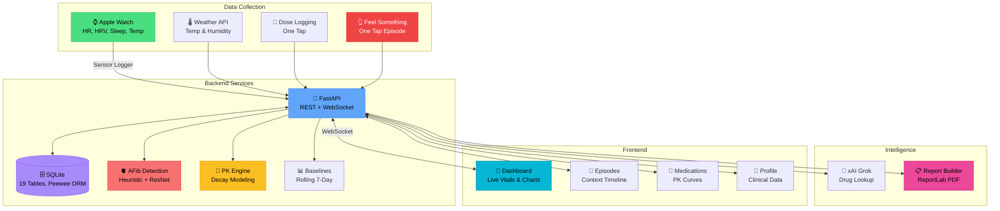
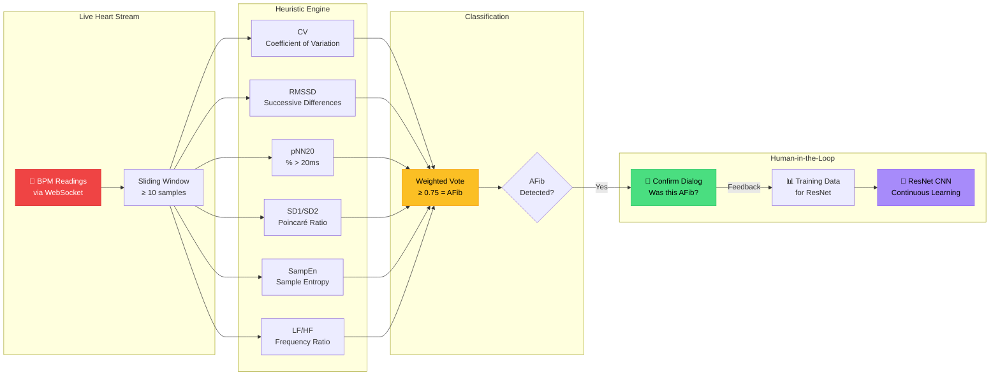
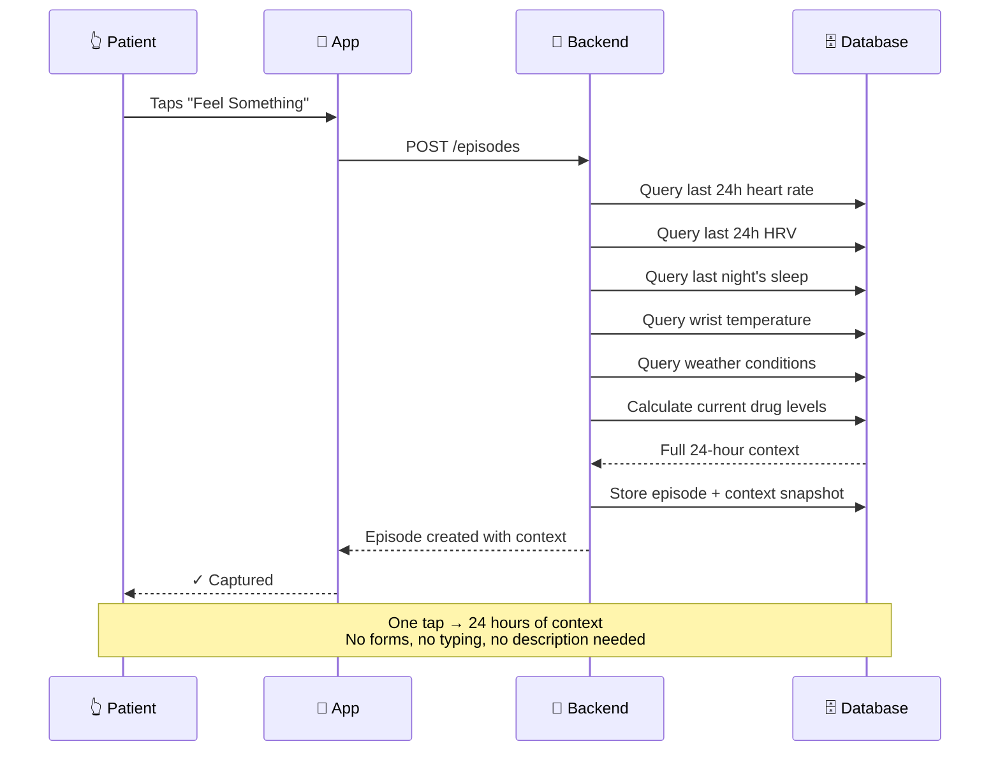
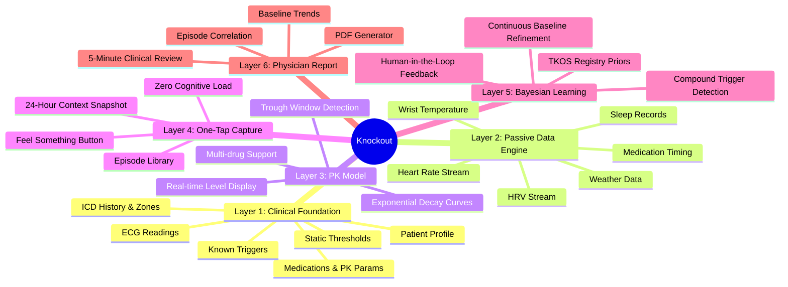

<div align="center">


# **Knockout**
## Cardiac Monitoring for Triadin Knockout Syndrome

*With ~340 patients on earth and zero clinical guidelines, every heartbeat matters.*

**We're making the invisible visible — one tap at a time.**

### HackRare 2026

[](https://www.hackrare.com/)
[](#)
[](#the-disease)

### **🔧 Technology Stack**

[](https://python.org)
[](https://fastapi.tiangolo.com)
[](https://pytorch.org)
[](https://react.dev)
[](https://nextjs.org)

[](https://tailwindcss.com)
[](https://sqlite.org)
[](#)
[](https://recharts.org)
[](https://x.ai)

</div>

---

## 💔 The Disease

**Triadin Knockout Syndrome (TKOS)** is an ultra-rare inherited heart condition. The triadin protein — which regulates calcium flow in heart muscle cells — is completely absent. Without it, the heart's electrical signaling misfires, causing life-threatening arrhythmias.

- **95%** experience cardiac arrest or fainting by age 3
- **74%** have recurrent breakthrough cardiac events even on aggressive treatment
- **68%** have implantable defibrillators (ICDs) — shock devices in their chest
- **0** clinical practice guidelines exist — every doctor is improvising
- Most patients are **children**

The entire body of published clinical knowledge comes from a registry of a few dozen patients at Mayo Clinic.

---

## 🫀 The Three Blind Spots

### 1. 🔇 The ICD Gap
Her ICD is **deliberately programmed to ignore** arrhythmias between 70–190 bpm. Why? Because in TKOS, the pain from an ICD shock triggers adrenaline, which causes *more* arrhythmia, which triggers *another* shock — a deadly feedback loop called **arrhythmia storm**. So subclinical events in this range go completely **unlogged**.

### 2. ⏳ The Visit Gap
Between quarterly cardiologist visits, **~2,160 waking hours pass** with zero clinical observation. Symptoms recalled from memory weeks later lose all detail and all context.

### 3. ❓ The "Why" Gap
Even when events are documented, nobody systematically asks: *Was it the medication trough? The heat? Poor sleep? All three at once?* Individual factors get noted sometimes. **The combination — which is what actually matters — is never captured.**

---

## 💡 The Knockout Solution

We're building a system that **passively watches everything happening in a TKOS patient's body and environment**, lets them flag moments with **one tap**, and generates physician reports that make the invisible visible.

### **How It Works**

#### 1. 🏥 Clinical Foundation
Before collecting a single new data point, the system loads **everything already known** about this specific patient — thresholds from stress tests, ICD shock history, medication parameters, documented triggers. With 340 patients worldwide, generic thresholds are useless. **Her normal is the only normal that matters.**

#### 2. 📡 Passive Data Engine
Six streams run continuously with **zero patient effort** — just an Apple Watch and a phone:

| Stream | What It Captures | Why It Matters |
|--------|-----------------|----------------|
| **Heart Rate** | Continuous BPM | Detects deviations from *personal* baseline |
| **HRV** | Beat-to-beat variability | Autonomic stress indicator, AFib precursor |
| **Sleep** | Duration & quality | Sleep debt independently raises arrhythmia risk |
| **Wrist Temperature** | Fever detection | +10 bpm per °F, independent arrhythmia trigger |
| **Weather** | Temperature & humidity | Heat increases cardiac workload |
| **Medication Timing** | Daily dose confirmation | The only active input required |

Everything is compared against **personal rolling 7-day baselines**, not population norms.

#### 3. 💊 Pharmacokinetic Model
The most novel part. Nadolol (her beta-blocker) has a ~22-hour half-life. By the next morning, she's at **~50% coverage** — the trough window. The system models medication blood levels as a continuous curve:

```
remaining = dose_mg × 0.5^(elapsed_hours / half_life_hours)
```

**The key insight:** Do her episodes cluster during trough windows? If she consistently feels something 18–20 hours after her dose, that's actionable — the cardiologist can adjust timing, split the dose, or switch medications. **This correlation is currently invisible.**

#### 4. 👆 One-Tap Capture
A single red button — always accessible. When she feels something (palpitations, dizziness, "something's off"), she taps **once**:
- Timestamp recorded
- Last **24 hours** of all six streams automatically captured
- Current medication coverage percentage logged
- Entry added to her episode library

**No typing. No forms. No description needed.** During an episode, cognitive load is at its peak — especially for a child. One gesture is the maximum you can ask for.

#### 5. 🧠 Bayesian Learning Model
The system **learns as it goes**. The heuristic engine flags potential AFib events, the patient confirms or denies, and that feedback updates the model's priors — a true Bayesian loop. Baselines aren't static; they refine continuously as more data flows in. Start with TKOS registry priors, update with every confirmation, every denied false positive, every new day of passive data. After ~20–30 labeled events, the model identifies which stream combinations most reliably precede *her* episodes specifically.

> **Critical design constraint:** Stress triggers arrhythmias in TKOS. A frightening alert could *cause* the exact event it's warning about. Any notification must be calm, clinical, quiet — never alarming.

#### 6. 📋 Physician Report Generator
One button generates a structured **PDF for the cardiologist visit**. No more "How have you been?" followed by months of experience recalled from memory.

The report contains:
- Baseline trends over the reporting period
- Medication trough windows mapped against HRV
- Full episode library with 24-hour context
- Stream correlation analysis
- Trajectory — improving, stable, or declining

Formatted for a **5-minute clinical review**, prioritized by significance, not chronology.

---

## 🏗️ System Architecture

### **High-Level Overview**



### **AFib Detection Pipeline**



### **Episode Context Capture**



### **Six-Layer Architecture**



---

## 🧬 Edge-Deployable AFib Model

Our vision is to run AFib detection **on-device** — on a phone or watch, not a cloud server. That means high accuracy in a tiny footprint.

We train a **1D ResNet** (~2M parameters) on BPM windows using the **Muon optimizer** ([arxiv.org/abs/2509.15816](https://arxiv.org/abs/2509.15816)). Traditional optimizers like Adam flatten weight matrices into 1D vectors, drowning out small gradient changes — exactly the subtle arrhythmia signals we need to catch. Muon preserves the 2D structure of each weight matrix by projecting gradient momentum into a **dual space** via **singular value decomposition**:

\$$G = U \Sigma V^\top \quad \longrightarrow \quad O = U V^\top$$

The closest orthogonal matrix drops \( \Sigma \), so every direction updates equally — no dominant features drowning out subtle arrhythmia signals. Exact SVD is expensive, so we approximate the polar factor with **5 Newton-Schulz iterations**:

\$$X_{k+1} = X_k + \tfrac{1}{2} X_k (I - X_k^\top X_k)$$

The result: our trained checkpoint is **2.2 MB** — roughly the size of a single high-quality photo. Conv1d weights are reshaped to 2D via a custom `ConvMuonWrapper`, while biases and batch norm parameters use AdamW. Human-in-the-loop feedback from the heuristic engine continuously grows the training set.

---

## The Impact

### **For the Patient**
- **One tap** — capture a symptomatic moment with full context, no forms
- **Personal baselines** — thresholds calibrated to *her*, not textbook ranges
- **ICD Gap coverage** — monitoring the 70–190 bpm blind zone her defibrillator ignores
- **Calm by design** — no scary alerts that could trigger the very arrhythmia they warn about

### **For the Cardiologist**
- **Structured data, not stories** — replace memory-based visits with longitudinal evidence
- **Trough-episode correlation** — see if episodes cluster during medication dips
- **24-hour episode context** — every tap comes with vitals, drug levels, sleep, and weather
- **5-minute PDF review** — prioritized by clinical significance

### **For the Disease**
- Fill the ICD's deliberate blind zone with continuous passive monitoring
- Make subclinical events visible to clinicians for the first time
- Enable data-driven treatment decisions for a disease with zero guidelines
- Build longitudinal datasets that could advance TKOS understanding globally

---

## Features

### **Dashboard**
- **Live Heart Rate** with pulsing heart synced to BPM
- **Real-time HRV Metrics** — CV, RMSSD, pNN20, SD1/SD2, SampEn, LF/HF
- **AFib Detection** — live status badge with confidence bar
- **Drug Level Curves** — 48-hour PK visualization for all active medications
- **ICD Gap Monitor** — watches the 70–190 bpm zone
- **Sleep & Baselines** — 7-day rolling averages
- **Feel Something FAB** — floating red button, always accessible

### **Episodes**
- **Episode Timeline** — chronological list with date filters
- **24-Hour Context** — vitals, drug levels, deviations, weather for each tap
- **Deviation Tags** — automatic flagging of what was abnormal
- **Drug Level Stack** — medication coverage at time of episode
- **Trigger Tags** — matched against known personal triggers

### **Medications**
- **Med Cards** — active medications with PK parameters
- **Dose Logging** — tap to log, exponential decay tracks the rest
- **Drug Checker** — interaction and safety lookups
- **Add Medication** — auto-lookup half-life via xAI Grok

### **Reports**
- **PDF Report Builder** — select date range, generate structured cardiology report
- **Baseline trends**, episode correlations, medication analysis
- **Formatted for clinical review** — designed for a 15-minute visit

### **Profile**
- **Patient Info** — demographics, diagnoses, allergies
- **ICD Details** — device model, zones, shock history
- **ECG History** — 14 historical readings
- **Triggers Card** — known triggers with source and confidence
- **Emergency Contacts**

---

## 🚀 Quick Start

### **Prerequisites**

```bash
python --version   # Python 3.12+
node --version     # Node.js 18+
uv --version       # uv package manager
```

### **Backend**

```bash
cd backend

# Install dependencies
uv sync

# Start the server (auto-creates and seeds the database)
uv run python server.py
```

> Server runs at **http://localhost:8080** with WebSocket on the same port.

### **Frontend**

```bash
cd frontend

# Install dependencies
npm install

# Start dev server
npm run dev
```

> App runs at **http://localhost:3000**

### **Generate Demo Data**

With the backend running:

```bash
curl -X POST http://localhost:8080/synthetic/generate
```

This creates **7 days** of synthetic sensor data, episodes, and medication doses — everything needed to explore the full app.

### **Run a Simulation**

Replay clinical scenarios for demo purposes:

```bash
cd backend
uv run python server.py --simulate afib_episode
uv run python server.py --simulate vt_storm
uv run python server.py --simulate missed_dose_collapse
```

14 YAML scenarios available: AFib episodes, VT storms, healthy baselines, exercise triggers, nocturnal bradycardia, and more.

---

## 🔐 Environment Variables

Create `backend/.env`:

```bash
# xAI Grok (optional — enables automatic drug half-life lookup)
XAI_API_KEY=your_key_here
```

The server starts and runs fully without any API keys. Only `POST /drugs` auto-lookup requires the xAI key.

---

## 📊 API Reference

| Endpoint | Method | Description |
|----------|--------|-------------|
| `/push` | POST | Ingest sensor payloads (Sensor Logger format) |
| `/stats` | GET | Per-sensor request counts |
| `/ws` | WS | Live HR stream + real-time AFib detection |
| `/drugs` | GET/POST | Drug registry with half-life data |
| `/doses` | GET/POST/DEL | Dose logging and management |
| `/levels` | GET | Current PK decay levels for all active drugs |
| `/patient` | GET | Full profile + diagnoses + allergies |
| `/patient/icd` | GET | ICD device, zones, episodes, shock history |
| `/patient/icd/gap` | GET | ICD gap boundaries (70–190 bpm) |
| `/patient/ecg` | GET | 14 historical ECG readings |
| `/patient/thresholds` | GET | Patient-specific static thresholds |
| `/patient/medications` | GET | Active medications with PK parameters |
| `/patient/triggers` | GET | Known triggers with source & confidence |
| `/baselines` | GET | Rolling 7-day personal baselines |
| `/episodes` | GET/POST/DEL | Episode capture, listing, deletion |
| `/episodes/{id}/context` | GET | 24-hour context snapshot for an episode |
| `/report` | GET | Generate cardiology PDF report |
| `/afib/feedback` | POST | Human-in-the-loop AFib confirmation |
| `/synthetic/generate` | POST | Generate 7 days of demo data |

---

## 📁 Project Structure

```
knockout/
├── backend/
│   ├── server.py              # FastAPI entry point
│   ├── database.py            # 19 Peewee models + clinical seeding
│   ├── model.py               # ResNet AFib classifier (PyTorch)
│   ├── simulate.py            # YAML scenario replay engine
│   ├── routes/                # API route modules
│   │   ├── sensor.py          #   Sensor ingestion + WebSocket
│   │   ├── drugs.py           #   Drug & dose management
│   │   ├── patient.py         #   Clinical profile endpoints
│   │   ├── episodes.py        #   Episode capture & context
│   │   ├── baselines.py       #   Rolling 7-day baselines
│   │   ├── reports.py         #   PDF report generation
│   │   ├── afib_feedback.py   #   Human feedback loop
│   │   └── synthetic.py       #   Demo data generator
│   ├── services/              # Business logic
│   │   ├── heart_analyze.py   #   AFib detection (6 HRV metrics)
│   │   ├── baselines.py       #   Baseline computation
│   │   ├── llm_tools.py       #   Grok drug lookup
│   │   └── synthetic.py       #   Synthetic data generation
│   ├── report/                # Standalone PDF report module
│   ├── seed/clinical.json     # Patient data (from real records)
│   ├── simulations/           # 14 YAML clinical scenarios
│   └── training_data/         # AFib classifier training samples
├── frontend/
│   ├── app/                   # Next.js App Router
│   │   ├── page.tsx           #   Dashboard
│   │   ├── medications/       #   Medication management
│   │   ├── episodes/          #   Episode timeline
│   │   ├── reports/           #   Report builder
│   │   └── profile/           #   Patient profile
│   ├── components/            # UI components by domain
│   │   ├── dashboard/         #   LiveHeartChart, DrugChart, ICDGapMonitor
│   │   ├── episodes/          #   EpisodeCard, EpisodeContext, EpisodeTimeline
│   │   ├── medications/       #   MedCard, DrugChecker, AddMedModal
│   │   ├── profile/           #   PatientInfo, ICDDetails, ECGTable
│   │   ├── reports/           #   ReportBuilder
│   │   └── shared/            #   FeelSomethingFAB
│   ├── hooks/                 # useVitals, useHeartSocket, usePKData
│   └── lib/                   # API client, PK simulation, types
└── docs/                      # Design documents
    ├── overview.md            # Full project vision
    ├── prob_statement.md      # HackRare problem statement
    └── plans/                 # Layer-by-layer implementation plans
```

---

## 🫀 Why This Matters

A child with TKOS today lives under blanket restriction. *Don't run. Don't swim. Be careful.* The fear is constant — for the child and the family. Care is reactive: something happens, then everyone responds.

Knockout shifts the frame. It watches passively, learns personally, and builds a picture of this specific patient's risk landscape that **no 15-minute visit could ever produce**. It gives the cardiologist data they've never had. And it fills the gap between what the ICD catches and what actually happens in her body every day.

The technology isn't the point. The point is a child who gets told *"today is a good day"* — and a parent who can believe it.

---

<div align="center">

*Built with 🫀 at HackRare 2026 by Team Cardinal.*

</div>
